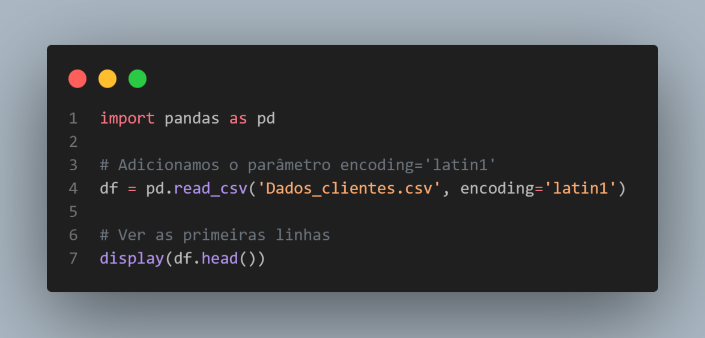
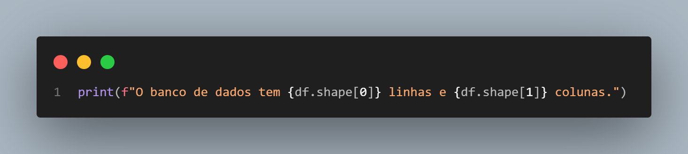
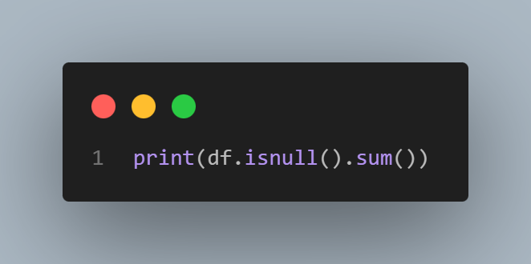
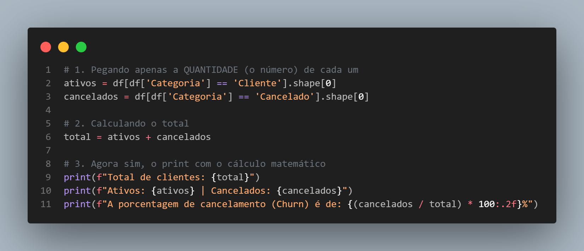
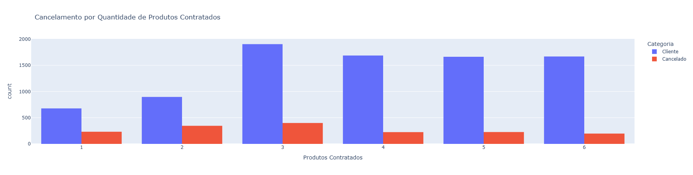
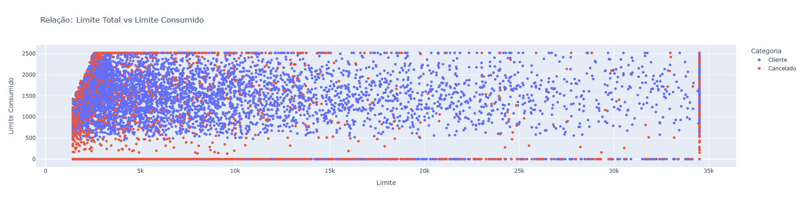

# 📊 Projeto de Análise de Churn: Retenção de Clientes Bancários

Este projeto utiliza **Python** e a biblioteca **Pandas** para investigar padrões que levam ao cancelamento de cartões de crédito.

## 🚀 Tecnologias Utilizadas
* **Python**
* **Pandas**
* **Plotly**

---

## 🛠️ Metodologia e Processamento de Dados

### 1. Importação e Leitura
O arquivo foi carregado utilizando o encoding `latin1` para suportar caracteres especiais.

* **Comando:** `pd.read_csv('Dados_bancarios.csv', encoding='latin1')`

### 2. Auditoria da Base
Verificamos o tamanho da base e a existência de valores nulos para garantir a qualidade da análise.

### 3. Segmentação de Grupos
Separei os clientes entre ativos e cancelados para comparar comportamentos médios.

### 4. Tratamento de Erros e Correção Lógica
Identificamos que cálculos matemáticos devem ser feitos sobre valores brutos (`.shape[0]`), evitando erros de lógica com tabelas inteiras.

---

## 🔍 Principais Insights Extraídos

1. **A Regra dos 4 Produtos:** Clientes com 4+ produtos têm maior retenção.
2. **Gargalo no Platinum:** Maior taxa de churn identificada nesta categoria.
3. **Engajamento:** Clientes que cancelam usam apenas 16% do limite.

---

## 📈 Visualização de Resultados

### Comparativo por Categoria de Cartão

### Relação Limite vs Consumo

